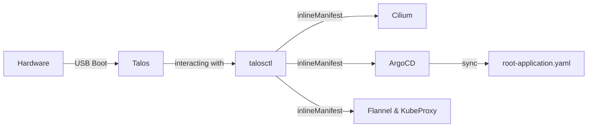
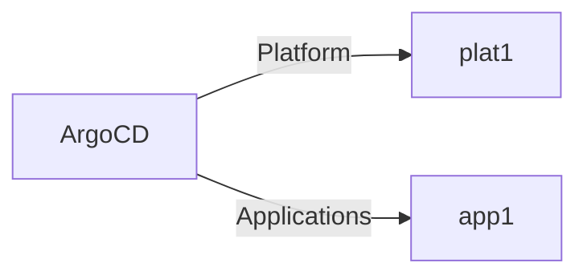
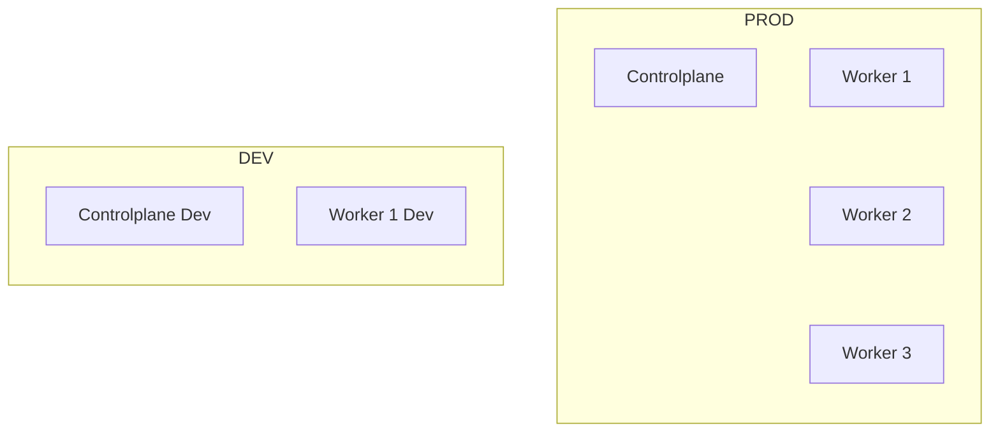

# Bootstrapping a Cluster

Bootstrapping should work as hands free as possible. Talos can help with that since it makes it possible to import manifests while bootstrapping. This gives me the Option to prepare a new install and once it is prepared spin up a cluster in no time.

- **ToDo**: Explore externalManifests to import different configs from a webserver at bootstrap, would make it possible to store everything behind an authentification as prerenderd Manifests.




## The Setup

I use 6 HP Elitedesk 800 G4 for my homelab and built two Talos Kubernetes clusters.



I decided in a Homelab usable computing availabilty and seperation of controlplane and applications are more important than a HA Controlplane and near zero worker node compute power. Having a dev cluster is also more important to me than having one bigger and more robust cluster, as it gives me the freedom of testing updates, new ideas or backup processes without the need to do it when no one else is using the system. It also gives me the freedom to just say "fuck it" whenever I break stuff while testing. I want to stop developing when I am done not when the system is running smoothly again. And I don't want to give a shit about data loss (e.g. Documents of friends and family) while tinkering aswell.

Only one controlplane is fine as long as I am able to recreate and fix a broken controlplane. The impact of losing a standalone controlplane is (hopefully) smaler than losing a standalone worker node.
This reasoning is mainly centered around userexperience. Having applications that other people use up and running is more important for me than having a controlplane to type `kubectl get pods`. But this also means I need to be able to
1. Backup and Restore a controlplane node or
2. Create a new Cluster from Scratch without Data loss from the applications

Either way the goal is: Losing a Controlplane is not an issue for applications or users, just for administrators (me).
Having applications available even if the cluster is not, will give me some wiggle room to choose the time I fix the cluster and not having someone locked out of something important.

I will explore both methods (restore vs recreate) and will decide later which one is the way to go. Having a dedicated Dev cluster is mandatory at this point and not a nice to have to evaluate these options.

## Initial Configuration HP Elitedesk 800 G4 and infrastructure preparations

To prepare the Kubernetes installations I configured:

- DHCP
- [Ventoy](https://www.ventoy.net/en/index.html) Boot Stick
- UEFI Settings of HP Elitedesks

### [Ventoy](https://www.ventoy.net/en/index.html) Boot Stick and Boot Images

I use [Ventoy](https://www.ventoy.net/en/index.html) to prepare my USB Stick.

To generate the Boot ISO I use the [Image Factory from SideroLabs](https://factory.talos.dev/).

There are multiple configurations I want when installing Talos from ISO.

|Setting|Configuration|
|--|---|
|Platform |Bare Metal Machine|
|Tals Version | 1.14.1|
|Machine Architecture| amd64 |
|SecureBoot| True |
|System Extension |siderolabs/i915, iscsi-tools|
|Customization| none |
|Embedded machine configuration|none|
|Bootloader| auto|

This results in:
```
# Schematic ID
faf8cda8f02221b31dc8338abdf17f91405e352f697a05b13c13a118ad8476d8
Installer Image:
factory.talos.dev/metal-installer-secureboot/faf8cda8f02221b31dc8338abdf17f91405e352f697a05b13c13a118ad8476d8:v1.14.1
```

Get the [final configuration of the Image](https://factory.talos.dev/?arch=amd64&platform=metal&schematic-id=faf8cda8f02221b31dc8338abdf17f91405e352f697a05b13c13a118ad8476d8&secureboot=true&target=metal&version=1.14.1)

Save the Image on the Ventoy Stick and

### Install talosctl

Talosctl should be in the same version as the Version you want to install talos in.

```sh
talosctl version --client
Client:
        Tag:         v1.14.1
        SHA:         2f86b9d2
        Built:
        Go version:  go1.26.8
        OS/Arch:     linux/amd64
```
If talosctl is older, remove and reinstall it

```sh
sudo rm /usr/local/bin/talosctl
curl -sL https://talos.dev/install | sh
```

### UEFI Settings (Secure Boot, WOL)

To prepare the hardware I first configured the Bootoptions and UEFI Settings.
When booting HP Elitedesk 800 G4 enter UEFI Menu with F10.

- F10 -> Advanced -> Secure Boot Configuration -> Legacy disabled, secure disabled
- Advanced -> Boot Options -> UEFI Boot Order -> Harddrive First
- Advanced -> Boot Options -> NumLock on at boot
- Advanced -> Build-In Device Options -> Wake on LAN
- Advanced -> HP Sure Recover -> disable HP Sure Recover
- Advanced -> System Options -> Virtualization Technology (VTx)
- Advanced -> System Options -> Virtualization Technology for Directed I/O (VT-d)
- Main -> System Information -> Show Advanced -> MAC Adresse for DHCP
- ESC ESC -> Save Changes -> Yes

### DHCP

I use Pihole for my setup and will configure static DHCP leases there for all my nodes under [settings -> dhcp -> advanced ](https://pi.hole/admin/settings/dhcp)

```csv
04:0e:3c:xx:xx:xx,192.168.xxx.xx,taloscp
04:0e:3c:xx:xx:xx,192.168.xxx.xx,taloswork-1
04:0e:3c:xx:xx:xx,192.168.xxx.xx,taloswork-2
04:0e:3c:xx:xx:xx,192.168.xxx.xx,taloswork-3
04:0e:3c:xx:xx:xx,192.168.xxx.xx,taloscp-dev
04:0e:3c:xx:xx:xx,192.168.xxx.xx,taloswork-1-dev
```

### Create ArgoCD Configuration

Sidero Labs have a great guide for [ArgoCD](https://docs.siderolabs.com/kubernetes-guides/advanced-guides/deploy-argocd). The files are located in `bootstrap/argocd`

**Step 1.** Download the Argo CD install manifest:
```sh
cd bootstrap/argocd
curl -Lo argocd-install.yaml \
  https://raw.githubusercontent.com/argoproj/argo-cd/stable/manifests/install.yaml
```
**Step 2.** Use kustomize to set the argocd namespace on every resource:
```sh
cat <<EOF > kustomization.yaml
apiVersion: kustomize.config.k8s.io/v1beta1
kind: Kustomization
namespace: argocd
resources:
  - argocd-install.yaml
EOF

kubectl kustomize . > argocd-install-namespaced.yaml
```
**Step 3.** Prepend the namespace definition so the namespace and its resources are created together:
```sh
cat <<EOF > argocd-namespace.yaml
apiVersion: v1
kind: Namespace
metadata:
  name: argocd
---
EOF

cat argocd-namespace.yaml argocd-install-namespaced.yaml > argocd-complete.yaml
```
**Step 4.** Generate the patch file, embedding the manifest in a `KubeInlineManifestConfig`:

```sh
yq -n \
  '.apiVersion = "v1alpha1" |
   .kind = "KubeInlineManifestConfig" |
   .name = "argocd" |
   .manifest = load_str("argocd-complete.yaml")' > argocd-inline-manifest-config.yaml
```

### Create Cilium Configuration

For Cilium the method is a bit different. I advise you to read both the Talos [Deploy Cilium CNI](https://docs.siderolabs.com/kubernetes-guides/cni/deploying-cilium#deploy-cilium-cni) and the [Cilium documentation](https://docs.cilium.io/en/stable/installation/k8s-install-helm/) and make the best out of them. If there was a missmatch between the two, mentions in the official docs of the specific tool always took precedence.

I installed Version 1.20.2 of Cilium (with helm) in the `kube-system` Namespace and deactivated Kube-Proxy. I used the Method 2: Helm with inlineManifest in Talos Docs and the [Using traditional Helm Repository](https://docs.cilium.io/en/stable/installation/k8s-install-helm/) with Talos Linux.

- ToDo: Check Cilium Helm Chart for more usefull config

**Cilium erstellt automatisch Zertifikate die im gerenderten Helm Chart stehen.Daher muss die Konfiguration jedes Mal neu erstellt werden und darf NICHT öffentlich abgelegt werden.**

```sh
cd ../cilium
helm repo add cilium https://helm.cilium.io/

# Added bpf.hostLegacyRouting for correct DNS resolution
# Added gatewayAPI.enabled for Gateway API

helm template cilium cilium/cilium --version 1.20.2 \
   --namespace $CILIUM_NAMESPACE \
   --set ipam.mode=kubernetes \
   --set kubeProxyReplacement=true \
   --set securityContext.capabilities.ciliumAgent="{CHOWN,KILL,NET_ADMIN,NET_RAW,IPC_LOCK,SYS_ADMIN,SYS_RESOURCE,DAC_OVERRIDE,FOWNER,SETGID,SETUID}" \
   --set securityContext.capabilities.cleanCiliumState="{NET_ADMIN,SYS_ADMIN,SYS_RESOURCE}" \
   --set cgroup.autoMount.enabled=false \
   --set cgroup.hostRoot=/sys/fs/cgroup \
   --set k8sServiceHost=localhost \
   --set bpf.hostLegacyRouting=true \
   --set gatewayAPI.enabled=true \
   --set k8sServicePort=7445 > cilium.yaml

yq -n \
  '.apiVersion = "v1alpha1" |
   .kind = "KubeInlineManifestConfig" |
   .name = "cilium" |
   .manifest = load_str("cilium.yaml")' > cilium-inline-manifest-config.yaml
```

## Install Talos

Installing Talos needs [talosctl](https://docs.siderolabs.com/talos/v1.14/getting-started/talosctl) and some Environment Variables. Configure them in a `.env` file (see `.env-example`). There are a lot of ways to load them automatically. More Informations on [https://env.dev](https://env.dev/guides/dotenv).

We want to have Cilium and ArgoCD in the Cluster from the beginning. This means we have to expand the standard Talos config with informations we created in the last chapter and disable `flannel` and `kube-proxy`. See [Remove Flannel and Kube-Proxy file](talos/patch-all.yaml).

Start PC with Ventoy USB Stick attached and enter Boot Menu with F9

- F9 -> Install Talos from Ventoy

If there is an Talos installation present, choose Talos Reset Disk after mounting the Talos iso. The next reboot will automatically boot from Ventoy


When installing for the first time or with a new set of Token, Secrets and Certificates run:
```sh
cd ../talos
talosctl gen secrets -o secrets.yaml
```

```sh
talosctl gen config $CLUSTER_NAME https://$CONTROL_PLANE_HOSTNAME.$DNS_DOMAIN:6443 \
  --with-secrets secrets.yaml \
  --install-disk /dev/nvme0n1 \
  --install-image factory.talos.dev/metal-installer-secureboot/faf8cda8f02221b31dc8338abdf17f91405e352f697a05b13c13a118ad8476d8:v1.14.1 \
  --config-patch @patch-all.yaml \
  --config-patch-control-plane @patch-controlplane.yaml \
  --config-patch-control-plane @../cilium/cilium-inline-manifest-config.yaml \
  --config-patch-control-plane @../argocd/argocd-inline-manifest-config.yaml

# if there is also a worker patch use this command
talosctl gen config $CLUSTER_NAME https://$CONTROL_PLANE_HOSTNAME.$DNS_DOMAIN:6443 \
  --with-secrets secrets.yaml \
  --install-disk /dev/nvme0n1 \
  --install-image factory.talos.dev/metal-installer-secureboot/faf8cda8f02221b31dc8338abdf17f91405e352f697a05b13c13a118ad8476d8:v1.14.1 \
  --config-patch @patch-all.yaml \
  --config-patch-worker @patch-worker.yaml \
  --config-patch-control-plane @patch-controlplane.yaml \
  --config-patch-control-plane @../cilium/cilium-inline-manifest-config.yaml \
  --config-patch-control-plane @../argocd/argocd-inline-manifest-config.yaml
```
At this point it is important to check your talosconfig ENV Variable and make sure it is pointed to the file you just created. Otherwise the next step could overwrite the wrong talosconfig

```sh
echo $TALOSCONFIG
<path to the talosconfig in your current directory>
```
If this is not correct update your .env file and source it again.


### Install Controlplane

First apply the config for the controlplane, then configer talosconfig and start the bootstrap command.
```sh
talosctl apply-config --insecure --nodes $CONTROL_PLANE_IP --file controlplane.yaml
# The Talosnode could be shut down or in need of a reboot at this point
talosctl config endpoints $CONTROL_PLANE_IP
talosctl bootstrap --nodes $CONTROL_PLANE_IP
talosctl kubeconfig --nodes $CONTROL_PLANE_IP
```

### Install Worker
If you are able to boot all Worker Nodes into the respective ISO at the same time, you can install all workers at once. Otherwise boot one worker and apply the config.

```sh
# multiple Worker at once
for ip in "${WORKER_IP[@]}"; do
    echo "Applying config to worker node: $ip"
    talosctl apply-config --insecure --nodes "$ip" --file worker.yaml
done

# One worker at a time
talosctl apply-config --insecure --file worker.yaml  --nodes 192.168.xxx.xx

```

### Check Cluster Status and Health

```sh
talosctl --nodes $CONTROL_PLANE_IP health
discovered nodes: ["192.168.xxx.xx" "192.168.xxx.xx"]
waiting for etcd to be healthy: ...
waiting for etcd to be healthy: OK
waiting for etcd members to be consistent across nodes: ...
waiting for etcd members to be consistent across nodes: OK
waiting for etcd members to be control plane nodes: ...
waiting for etcd members to be control plane nodes: OK
waiting for apid to be ready: ...
waiting for apid to be ready: OK
waiting for all nodes memory sizes: ...
waiting for all nodes memory sizes: OK
waiting for all nodes disk sizes: ...
waiting for all nodes disk sizes: OK
waiting for no diagnostics: ...
waiting for no diagnostics: OK
waiting for kubelet to be healthy: ...
waiting for kubelet to be healthy: OK
waiting for all nodes to finish boot sequence: ...
waiting for all nodes to finish boot sequence: OK
waiting for all k8s nodes to report: ...
waiting for all k8s nodes to report: OK
waiting for all control plane static pods to be running: ...
waiting for all control plane static pods to be running: OK
waiting for all control plane components to be ready: ...
waiting for all control plane components to be ready: OK
waiting for all k8s nodes to report ready: ...
waiting for all k8s nodes to report ready: SKIP
waiting for kube-proxy to report ready: ...
waiting for kube-proxy to report ready: SKIP
waiting for coredns to report ready: ...
waiting for coredns to report ready: SKIP
waiting for all k8s nodes to report schedulable: ...
waiting for all k8s nodes to report schedulable: OK

kubectl get nodes
```

After successfull installation save atleast the `secrets.yaml` to a secure location for later use, if possible save all generated files (`worker.yaml`, `controlplane.yaml`, `secrets.yaml` and `talosconfig`)
